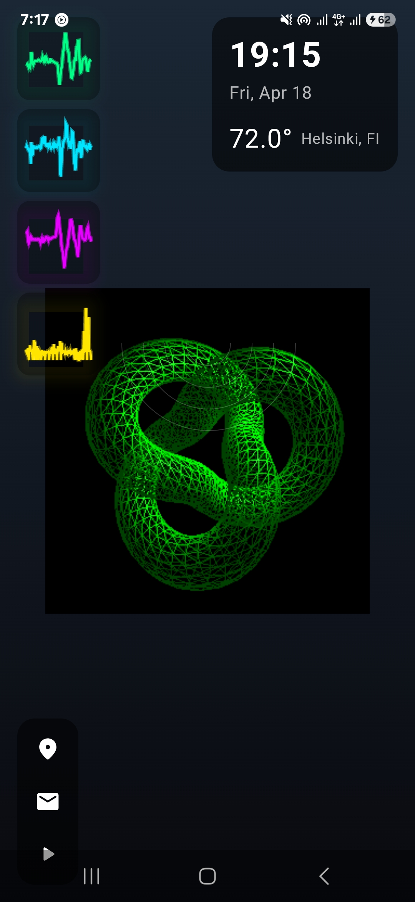

# Sci-Fi Sensor Visualizer App

A modern Android application that visualizes sensor data with sci-fi aesthetics using Jetpack Compose and interactive animations.

## Screenshot



The app features a modern, sci-fi inspired interface with real-time sensor visualizations, orbital animations, and translucent UI elements.

## Features

- Real-time sensor data visualization (Accelerometer, Gyroscope, Magnetometer, Audio)
- Interactive 3D orbital system using Anime.js
- Modern UI with translucent components and glow effects
- Quick access menu for location, messages, and music
- Clock and weather widget
- Auto-scaling sensor plots

## Tech Stack

- **Language**: Kotlin
- **UI Framework**: Jetpack Compose
- **Minimum SDK**: 24
- **Target SDK**: 34

### Dependencies

```kotlin
// Jetpack Compose
implementation("androidx.compose.material3:material3:1.1.2")
implementation("androidx.compose.material:material-icons-extended:1.5.4")
implementation("androidx.activity:activity-compose:1.8.2")

// WebView for Anime.js visualization
implementation("androidx.webkit:webkit:1.7.0")

// Sensors and hardware
implementation("androidx.core:core:1.12.0")
implementation("com.google.android.gms:play-services-location:21.0.1")

// Coroutines
implementation("org.jetbrains.kotlinx:kotlinx-coroutines-android:1.7.1")
implementation("org.jetbrains.kotlinx:kotlinx-coroutines-play-services:1.7.1")
```

## Project Structure

```
app/
├── src/
│   ├── main/
│   │   ├── assets/
│   │   │   └── visualizer.html    # Anime.js orbital visualization
│   │   ├── java/
│   │   │   └── com/example/aigenapp/
│   │   │       ├── data/
│   │   │       │   └── SensorData.kt
│   │   │       ├── sensors/
│   │   │       │   └── SensorManager.kt
│   │   │       ├── ui/
│   │   │       │   ├── components/
│   │   │       │   │   ├── CompactVisualizer.kt
│   │   │       │   │   ├── InfoWidget.kt
│   │   │       │   │   └── QuickMenu.kt
│   │   │       │   └── theme/
│   │   │       └── MainActivity.kt
│   │   └── AndroidManifest.xml
└── build.gradle.kts
```

## Setup Instructions

1. Clone the repository
2. Open in Android Studio
3. Sync Gradle files
4. Run on a device with sensors (accelerometer, gyroscope, magnetometer)

## Required Permissions

- `RECORD_AUDIO`: For audio level visualization
- `ACCESS_FINE_LOCATION`: For location services
- `ACCESS_COARSE_LOCATION`: For location services

## Contributing

Feel free to submit issues and enhancement requests.

## License

MIT License - feel free to use this code for your own projects.
